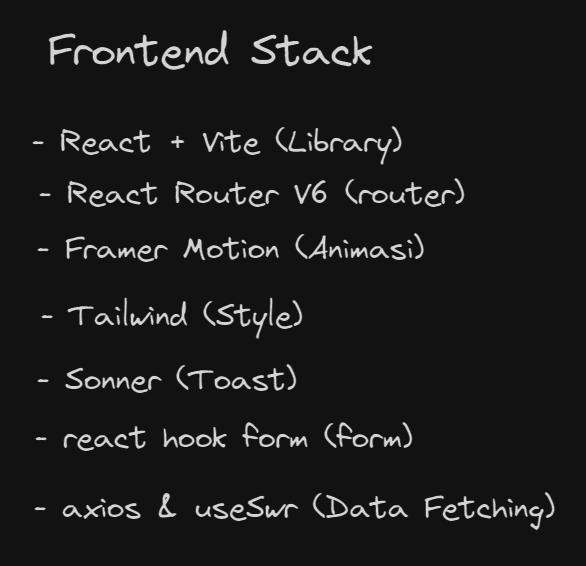

# FrontEnd-Khavi Stack



Check Installation in [`issue`]()

> Note: **Catatan:** Daftar teknologi ini dapat berubah dan bertambah.

## Peraturan

### 1. Commit Pesan

Panduan format pesan komit dapat dilihat [disini](https://github.com/KHASs-Kharisma-Vidya-Seni/FrontEnd-Khavi/blob/main/docs/commit.md).

### 2 Cara Insall Tools Commit

Pertama yaitu install package :

```bash
 npm install -g commitizen
```

Kedua

```bash
commitizen init cz-conventional-changelog --yarn --dev --exact
```

### 3. Penggunaan

Paling penting adalah `git cz` untuk commit pesan

Pertama

```bash
git add .
```

Kedua

```bash
git cz
```
